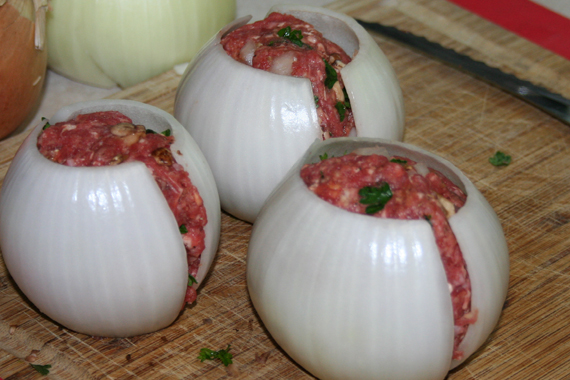
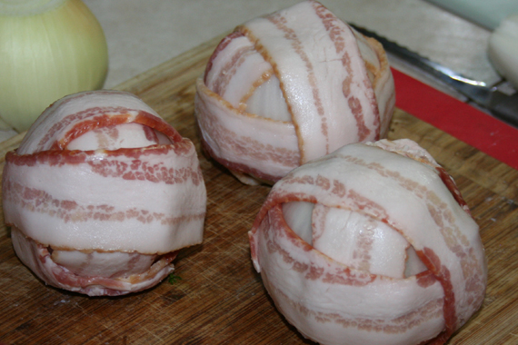
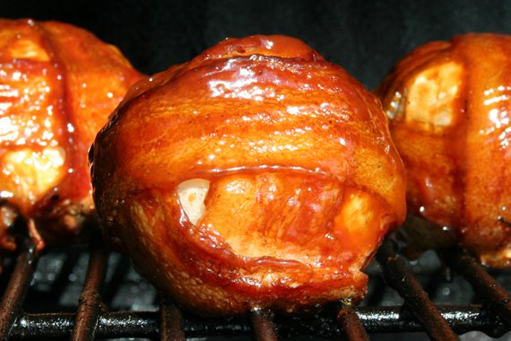

# Bacon Wrapped Onion Bombs.

## Ingredients

- 2 pounds ground beef
- 1 cup bread crumbs
- 1 egg, beaten
- 1 cup milk
- 1/2 cup BBQ Sauce
- 1 teaspoon salt
- 1/2 teaspoon black pepper
- 1/2 teaspoon garlic powder
- 3-4 Yellow Onions (med-large)
- 1 Package of Bacon
- More BBQ Sauce

## Steps

In a large bowl, combine the ground beef, crumbs, egg, milk, ½ cup BBQ, onion, salt, pepper and garlic powder. Mix together with your hands until thoroughly combined.
Cut top and bottom off onion, cut in half and peel off skin. Then separate the onion into "layers". Use the larger outside layers.
Stuff your Meatloaf mix between two Onion Layers (essentially making an onion seal around a large meatball)
Wrap each "bomb" with 3 slices bacon and secure with toothpicks.
Bake in a dish with sides (to catch grease) at 425 for approx 40 minutes or until internal temp 165.
Add BBQ sauce all over and bake an additional 5 minutes!

