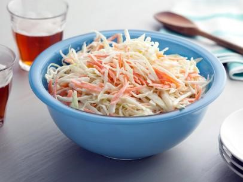

# Creamy Cole Slaw

## Ingredients

- 1 head green cabbage, finely shredded 
- 2 large carrots, finely shredded 
- 3/4 cup best-quality mayonnaise 
- 2 tablespoons sour cream 
- 2 tablespoons grated Spanish onion 
- 2 tablespoons sugar, or to taste 
- 2 tablespoons white vinegar 
- 1 tablespoon dry mustard 
- 2 teaspoons celery salt 
- Salt and freshly ground pepper 

## Steps

Combine the shredded cabbage and carrots in a large bowl. Whisk together the mayonnaise, sour cream, onion, sugar, vinegar, mustard, celery salt, salt, and pepper in a medium bowl, and then add to the cabbage mixture. Mix well to combine and taste for seasoning; add more salt, pepper, or sugar if desired. 

Clipped from: http://www.foodnetwork.com/recipes/bobby-flay/creamy-cole-slaw-recipe.html